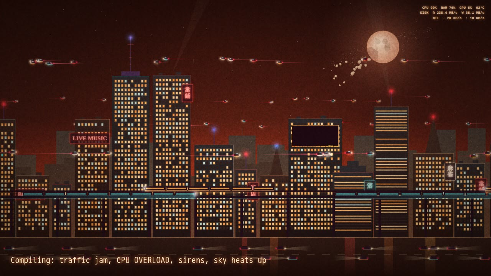

# Neon City

[](docs/demo.mp4)

The [video](docs/demo.mp4) runs on scripted load, not a real machine: idle, a big download, a compile that maxes CPU and RAM, then gaming, then idle again with random events.

A KDE Plasma 6 wallpaper: an animated skyline that reacts to what your machine is doing. It has a Cowboy Bebop look (the default) and a plain neon one, switchable in the wallpaper settings.

- **CPU:** more and faster flying cars and street traffic, flickering windows; above 90% sirens flash and the billboard reads CPU OVERLOAD.
- **RAM:** how many windows are lit; above 90% the billboard reads MEMORY FULL.
- **Disk:** trains on the elevated line, reads heading right and writes heading left.
- **Network:** downloads make it rain, uploads send pulses up from the antenna tower.
- **GPU:** brightness of the searchlights and the billboard equalizer.
- **CPU temperature:** sky color, drifting to red as it heats up.
- **Random events:** 0 to 2 every 30 minutes (police chase, meteor, fireworks, lightning, blackout, blimp, UFO, glitch).

Install or update, then pick "Neon City" in the wallpaper settings of the screen you want:

```bash
kpackagetool6 -t Plasma/Wallpaper -i . || kpackagetool6 -t Plasma/Wallpaper -u .
```

Plasma keeps the old version loaded after an update until `systemctl --user restart plasma-plasmashell`.

Preview in a browser without Plasma: serve `contents/ui` over HTTP and open `city.html?demo=1` (keys 1 to 8 fire events). Remove with `kpackagetool6 -t Plasma/Wallpaper -r me.yusufipek.neoncity`.

It redraws at 30 fps even when covered by windows. On an i5-12400F that costs about 20% of one CPU core (renderer plus the Plasma shell copying its frames) and about 190 MB of RAM, with no measurable GPU load; append `&fps=20` to the page URL in `main.qml` to lower that. The Bebop look is an unofficial fan homage, not affiliated with the show or its rights holders.
