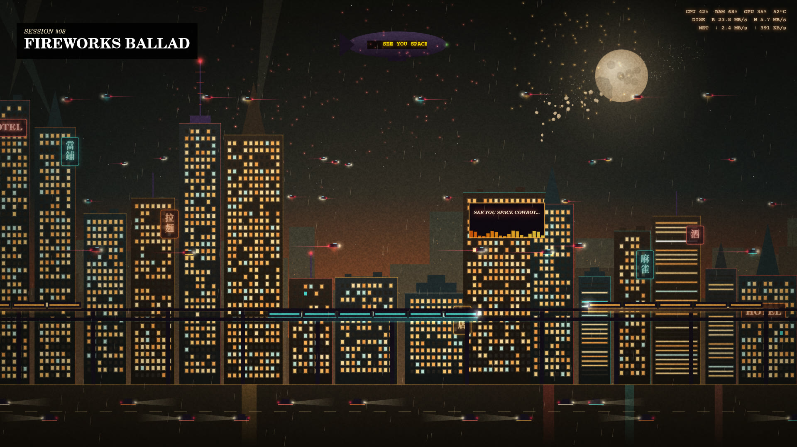

# Neon City



A KDE Plasma 6 wallpaper: an animated skyline that reacts to CPU, RAM, disk, network, GPU load and CPU temperature, with 0 to 2 random events in every 30 minutes. It has a Cowboy Bebop look (the default) and a plain neon one, switchable in the wallpaper settings. The mapping is at the top of `contents/ui/city.js`.

Install or update, then pick "Neon City" in the wallpaper settings of the screen you want:

```bash
kpackagetool6 -t Plasma/Wallpaper -i . || kpackagetool6 -t Plasma/Wallpaper -u .
```

Preview in a browser without Plasma: serve `contents/ui` over HTTP and open `city.html?demo=1` (keys 1 to 8 fire events). Remove with `kpackagetool6 -t Plasma/Wallpaper -r me.yusufipek.neoncity`.

It redraws at 30 fps even when covered by windows, about 5% of one CPU core here; append `&fps=20` to the page URL in `main.qml` to lower that. The Bebop look is an unofficial fan homage, not affiliated with the show or its rights holders.
